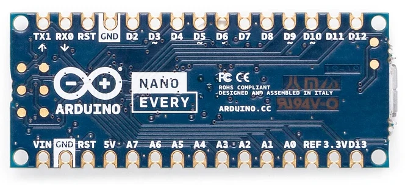
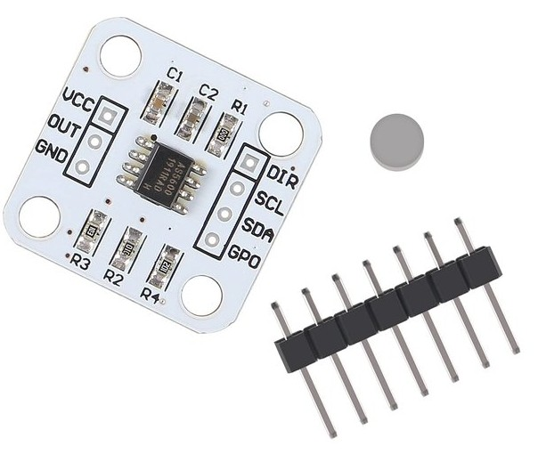

# Circular Needle Character Input Device

> Nota: Uma tradução em português (Brasil) desta página está disponível aqui: [README-PT-BR.md](README-PT-BR.md)

This project is a physical way to type letters. A needle spins freely over a circular dial marked **A–Z** and **0–9**. You point the needle at a character, hold it still, and that character appears on the computer.

Nothing on the dial is a switch. A magnet on the shaft turns a short distance above an AS5600 magnetic encoder. An Arduino Nano reads the angle and sends it over USB. A Python program on the computer turns that angle into letters, prints them, and writes a log file.

Build it in this order: understand the design, install the software your computer needs, prove the electronics on a breadboard (no glue), then assemble the wooden dial, then calibrate and type. Do not glue or assemble the mechanical parts until you can see the angle change on the computer.

---

## Contents

1. [What you are building](#what-you-are-building)
2. [How it works](#how-it-works)
3. [The two programs](#the-two-programs)
4. [Parts](#parts)
5. [Installation](#installation)
6. [Build and run](#build-and-run)
7. [Mechanics](#mechanics)
8. [Type letters](#type-letters)
9. [capture.py reference](#capturepy-reference)
10. [Arduino cheat sheet](#arduino-cheat-sheet)
11. [Done when](#done-when)

---

## What you are building

```
You move the needle (M03)
        |
        v
Shaft (M02) turns in a bearing (M01)
        |
        v
Magnet (E03) on the shaft end turns
        |
        v
AS5600 (E01) measures the angle 0–360°  (no contact)
        |
        v
Nano (E02) prints  a=123.4  over USB (E06)
        |
        v
Python on the PC  -->  maps the angle to a letter  -->  console + log file
```

| Spins as one unit | Stays fixed |
|-------------------|-------------|
| Needle (M03), shaft (M02), magnet (E03) | Bearing outer race (M01), wood base (M04), sensor, Nano, PC |

The firmware on the Nano is deliberately simple: it only streams angles.  
The Python program on the computer does the rest: a 36-character map, a short A / J / S / 1 check each session, settle detection, and logging.

---

## How it works

```
  TOP VIEW                         SIDE STACK (center)

      7  A  D                         M03  ========●========► needle
    4         G                            |
  1      ●------► M                   M02  |  shaft
    Y         J                            |
      V  S  P                         M01  (====)  bearing in M04 base
                                           |
                                      E03  [N|S]   magnet on shaft END
                                           |  1–3 mm air gap
                                      E01  [AS5600]
                                           |
                                      E04  wires
                                      E02  [Nano] ---- E06 USB ---- PC
```


Item codes match the [parts list](#parts): **E** is electronics, **M** is mechanics.

The magnet must be a **diametric** disc (the poles sit on opposite sides of the face, not on the two flat faces). It lives on the **bottom tip** of the shaft, 1–3 mm above the black chip on the AS5600. The shaft goes through the bearing only, not through the magnet.

Printed dials (print at 100%, no fit-to-page) are in `docs/base-templates/`. Sizes run from 6" to 10". **A** is at north. Letters run clockwise, A–Z then 0–9. The letters sit **outside** the cut circle. 6" and 7" are letter size; 8", 9", and 10" are tabloid (11×17).

Each size has several layouts (example names are the 6" files):

| File | Layout |
|------|--------|
| `dial-6in.pdf` | Spokes from the center to each character |
| `dial-6in-nolines.pdf` | Letters only, no spokes |
| `dial-6in-big.pdf` | Larger letters, with spokes |
| `dial-6in-big-nolines.pdf` | Larger letters, no spokes |
| `dial-6in-box.pdf` | A small box just **before** each character — point the needle into the box |
| `dial-6in-big-box.pdf` | Larger letters plus aiming boxes |

The `-box` files are the easiest to aim: the box sits on the rim, in line with the letter, so you can see when the pointer is on that character.

### Repository layout

```
medium-device/
  README.md
  docs/                diagrams, photos
  docs/base-templates/ printable dials (6–10 in, several layouts)
  firmware/            Arduino sketches (open these in Arduino IDE only)
  host/                Python capture program
  logs/                created at runtime
```

---

## The two programs

You use **two different tools**. They are not interchangeable.

| | What it does | Which app | File |
|---|--------------|-----------|------|
| 1 | Puts code **on the Nano** so the board can read the magnet | **Arduino IDE** | `firmware/needle_angle_stream/needle_angle_stream.ino` |
| 2 | Shows those numbers **on the computer**, then turns them into letters | **Terminal** → Python | `host/capture.py` |

A few things that are easy to mix up:

- The `.ino` file is **not** Python. Do not run it with `python`.
- Open it only in Arduino IDE, with **File → Open**.
- `capture.py` has nothing to read until the firmware has been uploaded successfully.
- A red or blinking LED on the Nano means the board has **power**. That is often the factory blink sketch. It is not this project’s program until you click Upload and it finishes.

The rest of this document assumes those two roles stay separate: Arduino IDE talks to the Nano; Python talks to the serial port the Nano creates.

---

## Parts

### Items

| Code | Item | What it does | Link |
|------|------|--------------|------|
| **E01** | AS5600 module | Measures magnet angle | [HiLetgo](https://www.amazon.com/HiLetgo-Magnetic-Encoder-Measurement-Precision/dp/B09KGWC1PT) |
| **E02** | Arduino Nano (ATmega328P + CH340) | Reads E01, sends USB serial | [Nano V3.0, Nano Board ATmega328P...](https://www.amazon.com/dp/B07G99NNXL?ref=ppx_yo2ov_dt_b_fed_asin_title) |
| **E03** | Diametric magnet disc | Turns with the shaft so E01 can sense it | [Eliveshown](https://www.amazon.com/Eliveshown-Diametrically-Neodymium-6-35x6-35-diametrical/dp/B0D2C9VNVR) — skip if included with E01 |
| **E04** | Dupont jumper wires | Connect E01 pins to E02 pins | [EDGELEC](https://www.amazon.com/EDGELEC-Optional-Breadboard-Assorted-Multicolored/dp/B07GCZ52WF) |
| **E05** | Half-size breadboard | Temporary wiring, no solder | [ELEGOO](https://www.amazon.com/ELEGOO-tie-points-breadboard-Arduino-Jumper/dp/B01EV640I6) |
| **E06** | USB **data** cable | Power and serial (Mini-B or USB-C) | Often in the Nano pack; must support data, not charge-only |
| **M01** | Ball Bearings | Rotation for the rod | [Amazon](https://a.co/d/0bbrJnqB) |
| **M02** | 3 mm stainless rod | Shaft / axle | [Sutemribor](https://www.amazon.com/Sutemribor-100mm-Straight-Helicopter-Airplane/dp/B076XY82K3) |
| **M03** | Balsa sticks | Light needle | [Amazon](https://www.amazon.com/Perfect-Modeling-Hobbies-Architecture-Mockups/dp/B0BYXN3443) |
| **M04** | ~10" wood circle | Dial / board | [Woodpeckers](https://www.amazon.com/Wooden-Plaques-Package-Unfinished-Woodpeckers/dp/B07VVFPFZR) |
| **M05a** | Super glue | Bond magnet and needle to shaft | [Loctite](https://www.amazon.com/Loctite-Super-Glue-Liquid-Professional/dp/B0CLQCKVDX) |
| **M05b** | Small screws + nuts for the base lags | |

ELEGOO Nano packs **without a cable** need a separate **Mini-B USB data** cable. Some Nanos ship with loose headers; those headers must be **soldered** before the board will sit in a breadboard.

### How each item works

**Electronics**

| Code | What it is | How it works | Where |
|------|------------|--------------|--------|
| **E01** | AS5600 PCB | Hall chip reads the magnet field and reports an angle 0–360° | Under the center of M04, chip facing the magnet |
| **E02** | Arduino Nano | Talks I2C to E01; prints `a=123.4` over USB | Breadboard for testing, or under the base later |
| **E03** | Solid diametric disc | Field rotates with the shaft | Glued on the **bottom end** of M02, 1–3 mm above E01 |
| **E04** | Dupont wires | Carry 5V, GND, SDA, SCL, and DIR→GND | Between E01 and E02 |
| **E05** | Breadboard | Solderless contacts | Bench, electronics phase |
| **E06** | USB cable | Power and data | E02 to the computer |

E03 is a **solid disc** (usually no hole). Glue it on the shaft **tip**. The shaft goes **through the bearing (M01)** only, not through the magnet.

**Mechanics**

| Code | What it is | How it works | Where |
|------|------------|--------------|--------|
| **M01** | 3 mm ID ball bearing | Outer race fixed; shaft spins inside | Center hole of M04 |
| **M02** | 3 mm rod, about 25–40 mm | Couples the needle and the magnet | Through M01 |
| **M03** | Balsa pointer | What you see move | Top of M02 |
| **M04** | Wood circle | Letter ring and structure | Table |
| **M05a** | CA glue | Bonds E03 and M03 to M02 | Shaft ends |
| **M05b** | Screw and nut | Balances the needle | Short end of M03 |

### Tools

**Required:** a desktop or laptop computer, a USB data cable, scissors or cutters, a ruler, a pencil.

**Optional:** a small screwdriver, a protractor or printed 10° template, a drill (about 8 mm for the bearing), a multimeter (only if wiring fails). You do not need a voltmeter if angles print. Windows may also need a CH340 USB-serial driver; that is covered in [Installation](#installation).

---

## Installation

Before you wire anything, install the two programs this project depends on:

1. **Arduino IDE** — used later to compile the sketch and write it onto the Nano.
2. **Python 3** with the **pyserial** library — used later to read the Nano and type letters.

Spoken letters (`--sound`) are optional. If you want them, install a speech engine as well. Everything below is offline and needs no account.

This project runs on a **Windows PC, a Mac, or a Linux computer**. It does not run on an iPhone or iPad.

Plug the Nano in only after the software is installed, so you can confirm the computer can see the USB port.

### Windows

1. Install [Arduino IDE](https://www.arduino.cc/en/software) (2.x is fine). Use the installer from the Arduino site.
2. Install [Python 3](https://www.python.org/downloads/). On the first installer page, tick **Add python.exe to PATH**.
3. Open **Command Prompt** or **PowerShell** in this repository and install pyserial:

   ```bat
   python -m pip install pyserial
   ```

   A virtual environment is optional but tidy:

   ```bat
   python -m venv .venv
   .venv\Scripts\activate
   python -m pip install -r host\requirements.txt
   ```

4. Optional, for spoken letters: `python -m pip install pyttsx3`. On Windows that uses the built-in speech voices.
5. Plug the Nano in with a **data** cable. A power LED should light.
6. In Arduino IDE, open **Tools → Port**. You should see a `COMx` port (for example `COM3`).

If no COM port appears: install a **CH340** USB-serial driver, unplug and replug the board, and try another cable. Charge-only cables power the LED and still do not create a port.

### macOS

1. Install [Arduino IDE](https://www.arduino.cc/en/software) (2.x is fine).
2. Install Python 3 if the Mac does not already have it. [python.org](https://www.python.org/downloads/) or Homebrew (`brew install python`) both work.
3. Open **Terminal** in this repository and install pyserial:

   ```bash
   python3 -m pip install pyserial
   ```

   Or use a virtual environment:

   ```bash
   python3 -m venv .venv
   source .venv/bin/activate
   pip install -r host/requirements.txt
   ```

4. Optional, for spoken letters: `pip install pyttsx3`.
5. Plug the Nano in with a **data** cable. A power LED should light.
6. In Arduino IDE, open **Tools → Port**. You should see something like `/dev/cu.usbserial-…` or `/dev/cu.wchusbserial-…`.

If no port appears, install a **CH340** driver for macOS, then unplug and replug. As on Windows, a charge-only cable will not work.

### Linux

1. Install [Arduino IDE](https://www.arduino.cc/en/software) (2.x is fine). Many distributions also package it; either source is fine as long as you can open the application and pick **Arduino Nano**.
2. Install Python 3 and pyserial. Prefer the distribution package, or a virtual environment. Do not fight the system installer with a bare `pip install` if it refuses (PEP 668).

   **Arch / Manjaro**

   ```bash
   sudo pacman -S python-pyserial
   ```

   **Debian / Ubuntu**

   ```bash
   sudo apt install python3-serial
   ```

   **Fedora**

   ```bash
   sudo dnf install python3-pyserial
   ```

   **Any distribution, isolated in this repo**

   ```bash
   python3 -m venv .venv
   source .venv/bin/activate
   pip install -r host/requirements.txt
   ```

   If you use the virtual environment, activate it before every `python host/capture.py` command: `source .venv/bin/activate`.

3. Optional, for spoken letters:

   ```bash
   # Arch / Manjaro
   sudo pacman -S espeak-ng

   # Debian / Ubuntu
   sudo apt install espeak-ng

   # Fedora
   sudo dnf install espeak-ng
   ```

   `espeak` or `speech-dispatcher` (`spd-say`) also work if they are already installed. `pip install pyttsx3` is a fallback; on Linux that library still needs **espeak-ng**. Speakers or headphones must already play sound.

4. Plug the Nano in with a **data** cable. A power LED should light.
5. In Arduino IDE, open **Tools → Port**. You should see `/dev/ttyUSB0` or `/dev/ttyACM0`.

Linux will often list the port and then refuse to open it until your user is in the serial group. That is not a broken cable.

- On Arch and Manjaro the group is **`uucp`**.
- On Debian, Ubuntu, and Fedora the group is **`dialout`**.

```bash
ls -l /dev/ttyUSB0          # see which group owns the port
sudo usermod -aG uucp "$USER"      # Arch / Manjaro
# sudo usermod -aG dialout "$USER" # Debian / Ubuntu / Fedora
```

Then **log out of the desktop completely and log back in**. Opening a new terminal is not enough. Check with `groups` — you must see `uucp` or `dialout`. In the same session without logging out: `newgrp uucp` (or `newgrp dialout`), then start Arduino IDE from **that** terminal.

### iOS (iPhone and iPad)

This project needs a desktop or laptop. Arduino IDE, a USB serial connection to the Nano, and the Python capture program do not run on iOS or iPadOS. Use a Windows PC, a Mac, or a Linux machine as the host.

---

## Build and run

Do the electronics work before any glue. The goal of this section is simple: rotate the magnet by hand and see changing `a=…` lines on the computer.

### What you need for this section

- Arduino IDE, already installed
- The Nano, the AS5600, jumper wires, and the breadboard
- A USB **data** cable
- The diametric magnet, held in your hand (not glued)
- Python and pyserial, already installed, if you want to watch the stream from the terminal

### How the breadboard works

Do **not** use the long **+** and **−** strips unless a later step says so. Those rails are **not** 5V or GND until you add extra jumpers. This project does not use them.

The **numbered rows** in the middle are what you use. In one row, on **one** side of the center gap, the five holes are the same wire:

```
     +  -                     -  +     <-- ignore these rails
     +  -                     -  +

        a  b  c  d  e     f  g  h  i  j
     1  o  o  o  o  o  |  o  o  o  o  o
     2  o  o  o  o  o  |  o  o  o  o  o
     3  o  o  o  o  o  |  o  o  o  o  o   <-- row 3 left is NOT row 3 right
        ============= trench ============
```

Example: the Nano **5V** pin sits in **row 20**, right side (f–j).  
Plug the AS5600 **VCC** jumper into **another hole in row 20, same side** (f–j). That *is* connecting to 5V.

```
  Wrong:  VCC jumper in a + rail hole
  Wrong:  VCC jumper in a random numbered row
  Right:  VCC jumper in the SAME numbered row as the Nano 5V pin,
          SAME side of the trench
```

Put the Nano **across the trench** (USB at one end). Left pins use columns a–e; right pins use f–j.

Find the **printed name** on the Nano (5V, GND, A0, A4, A5). Look which **number** that pin sits in. Use that number.

```
   Breadboard E05 (top view)

   [  +  -  . . . . . . . . . .  -  +  ]   power rails
   [  +  -  . . . . . . . . . .  -  +  ]

        .  .  .  .  .  .  .  .  .  .         one row = one electrical node
        ================================     center trench
        .  .  .  .  .  .  .  .  .  .

   Place the Nano ACROSS the trench
   so left pins and right pins are on opposite halves.
```

```
              USB (E06) to the computer
                    |
              +-----+-----+
              |           |
              |   NANO    |   <-- straddle the trench
              |   E02     |
              +-----------+
   left pins in left holes     right pins in right holes
```

The Nano must have pin headers so it can sit in the breadboard. If the pack is “loose headers,” solder them first (or use a presoldered Nano).

### Identify the pins

Look at the silkscreen on the Nano. You need these:

```
   Typical Nano (USB at top)

        [USB]
   D13               VIN
   ...               GND     <-- use this GND (black + purple DIR)
   ...               5V      <-- power to E01 (or 3.3V if the module is 3.3V-only)
   ...               A7
   ...               A6
   ...               A5 SCL  <-- clock to E01
   ...               A4 SDA  <-- data to E01
   ...               A3
```

Pin names are printed on the board. **A4** and **A5** are next to each other on the analog side.

On the AS5600 module, find the labels and use these five:

```
   E01 module (example)

   [  SCL ]---- to Nano A5
   [  SDA ]---- to Nano A4
   [  GND ]---- to Nano GND
   [  VCC ]---- to Nano 5V   (3.3V if the board says 3.3V only)
   [  DIR ]---- to Nano GND  (or a short jumper to the module GND pin)

   Leave open: OUT, PGO, GPO (if present)

   The small black IC in the middle is the sensor.
   The magnet hovers over THAT chip, not the whole PCB.
```

### Wiring pictures

- Arduino Nano:
  
  

- AS5600:
  
  

- Nano pin map (this project):

  

- Same five wires, boards as they sit on the bench:

  

- Red: **VCC → 5V**
- Black: **GND → GND**
- Blue: **SDA → A4**
- Yellow: **SCL → A5**
- Purple: **DIR → GND** (same Nano GND row as the black wire, or a short jumper from **DIR** to **GND** on the module)

Do **not** leave **DIR** floating. A floating DIR pin makes the 12-bit angle jump and look noisy. Tying it to GND locks clockwise counting (viewed from above the chip). Tying it to VCC would reverse the count; this project uses GND.

If you want the datasheet notes behind that rule:

- DIR must be GND or VCC, never floating: https://esphome.io/components/sensor/as5600/
- Fluctuating readings → connect DIR to GND: https://curiousscientist.tech/blog/as5600-magnetic-position-encoder
- Direction pin: https://github.com/RobTillaart/AS5600#dir-pin

### Wire the five cables

Unplug USB first.

```
AS5600 (E01)          Nano (E02)
VCC  ---------------  5V     (use 3.3V only if E01 says 3.3V-only)
GND  ---------------  GND
SDA  ---------------  A4
SCL  ---------------  A5
DIR  ---------------  GND    (same GND as the black wire — do not leave DIR open)
Nano USB  ----------  computer
```

| E01 pin | Wire to E02 pin | Suggested color | Role |
|---------|-----------------|-----------------|------|
| **VCC** | **5V** | Red | Power (use **3.3V** if E01 is labeled 3.3V-only) |
| **GND** | **GND** | Black | Ground (required) |
| **SDA** | **A4** | Blue / white | I2C data |
| **SCL** | **A5** | Yellow / green | I2C clock |
| **DIR** | **GND** | Purple | Direction lock (required for a stable angle) |

```
   E01 AS5600                         E02 Nano
   +-----------+                      +-----------+
   | VCC       |-------- red ---------| 5V        |
   | GND       |-------- blk ---------| GND       |
   | SDA       |-------- blu ---------| A4        |
   | SCL       |-------- yel ---------| A5        |
   | DIR       |-------- pur ---------| GND       |
   |           |                      | USB  ---------- E06 ---------- computer
   +-----------+                      +-----------+
         ^
         |  chip faces UP
```

Rules:

- Each jumper end must seat in the **same breadboard row** as the pin it should connect to (or clip onto the module header).
- Do not connect 5V to a 3.3V-only module.
- GND must be shared. No GND → nothing works.
- **DIR** and **GND** may share the same Nano GND row. A short jumper from DIR to GND on the module is the same electrically.

### Extra pins do not add resolution

The chip is still **12-bit** (4096 steps, about **0.088°**). DIR→GND does not add bits. It stops a floating DIR pin from randomly flipping the count direction, which is what looks like “bad precision.”

| Extra pin | Connect? | Why |
|-----------|----------|-----|
| **DIR** | **Yes → GND** | Datasheet: must be a real logic level. Floating = jumpy angle. |
| **OUT** | No for capture | Analog on the Nano is 10-bit, worse than I2C. |
| **PGO** | No — leave open | Programming pin. Tying it to GND can put the chip in burn/program mode. |
| **GPO** | No | Not used for I2C angle. |

After DIR is tied, more wires will not make the needle more precise. What does:

- A diametric magnet, **1–3 mm**, centered and parallel over the chip
- **I2C** (`needle_angle_stream.ino`), not analog OUT
- Short jumpers and solid 5V/GND (most modules already have a decoupling cap)
- The firmware already sets 2-LSB hysteresis and a 16× slow filter on the chip, reads the filtered ANGLE register, and averages 8 samples

### Place the magnet

Hold the disc **flat**, **1–3 mm** above the **center of the black chip** on E01. Parallel to the board, like a coin hovering.

```
        side view

        E03   (=======)   diametric disc, flat
                   |
                   |  ~1-3 mm air
                   v
        E01   [#### chip ####]==== PCB ====
```

You will rotate it **in place** after the firmware is running. Do not press it onto the chip. Do not glue it yet.

Hold the magnet 1–3 mm above the small black chip, then plug USB back in.

### Upload the firmware

You need **Arduino IDE** for this step. The file is Arduino firmware, not a Python script. It uses only the built-in `Wire` library. Do **not** install an extra AS5600 library. Do **not** run this file with `python`.

Path:

```
firmware/needle_angle_stream/needle_angle_stream.ino
```

1. Start the **Arduino IDE** application (from the app menu, or `arduino` / `arduino-ide` on Linux). This is not a terminal Python command.
2. **File → Open**. In the file picker, go into this project, then:

   `firmware` → `needle_angle_stream` → select **`needle_angle_stream.ino`** → **Open**

3. The editor must show C++ that starts with `#include <Wire.h>`. If you see Python, you opened the wrong file.
4. **Tools → Board → Arduino AVR Boards → Arduino Nano**
5. **Tools → Processor → ATmega328P**
6. **Tools → Port** → the port from [Installation](#installation):
   - Windows: `COMx` (for example `COM3`)
   - macOS: `/dev/cu.usbserial-…`
   - Linux: `/dev/ttyUSB0` or `/dev/ttyACM0`

   No port, or **Permission denied**? Go back to the install section for your operating system. On Linux that is almost always the serial group plus a full logout.

7. Click the **Upload** button at the top (right arrow **→**).  
   Wait until the bottom of the IDE says **Done uploading**.

If Upload fails:

1. **Tools → Processor → ATmega328P (Old Bootloader)** → Upload again.
2. Confirm the correct **Port**.
3. Close Serial Monitor, then upload (an open monitor can lock the port).
4. Press the Nano **RESET** button just as upload starts.

That step copies our program **into the Nano**. After that, whenever the Nano has power it prints `a=123.4` over USB.

### See the rotation on the computer

You can watch the stream in Arduino IDE or in the terminal. Either is enough to prove the electronics.

**In Arduino IDE**

1. **Tools → Serial Monitor** (or Ctrl+Shift+M / Cmd+Shift+M).
2. Bottom right: baud **115200** (must match the sketch).
3. You should see a stream:

```
a=47.3
a=47.4
a=48.1
a=90.2
```

**In the terminal** (needs Python and pyserial from [Installation](#installation))

From the repository root:

```bash
python host/capture.py --all
# or, if several ports exist:
# python host/capture.py --all --port COM3
# python host/capture.py --all --port /dev/ttyUSB0
```

Turn the magnet. After upload you should see `filter: hyst=2lsb …` once, then changing lines:

```text
a=47.28    (turn the magnet — this number should move)
a=90.14    (turn the magnet — this number should move)
```

**Ctrl+C** stops the Python program.

A full turn should cover about 0–360 (or wrap 359 → 0).

### If you see `scan: none` — run the wire check

Software cannot always name one open wire (I2C needs VCC, GND, SDA, and SCL). This extra sketch tests the Nano pins, an optional **OUT→A0** jumper, and prints a verdict. Keep **DIR → GND** as in the normal five-wire hookup.

1. Keep VCC, GND, SDA, SCL, and **DIR → GND** as usual.
2. Add one extra jumper if the module has **OUT** (diagnosis only): **AS5600 OUT → Nano A0**.
3. Arduino IDE → **File → Open** → `firmware/wire_check/wire_check.ino` → **Upload**.
4. Watch Serial Monitor at **115200**, or run `python host/capture.py --all`.
5. Read the **Verdict** line.

| Verdict | Meaning |
|---------|---------|
| I2C works | Use `needle_angle_stream.ino` again |
| A4/A5 sit LOW | That jumper is shorted or in the wrong row |
| Module looks POWERED | VCC/GND OK → SDA or SCL wrong or swapped |
| A0 near 0 | No power on the module, or OUT not on A0 |

When the check is done, upload `needle_angle_stream.ino` again. Leave the OUT jumper off for normal use.

### What the output means

| You see | Meaning | What to do |
|---------|---------|------------|
| `a=123.4` changing as you turn | Success | Stop here; go on to the wooden dial |
| `a=ERR` over and over | I2C fail: wiring or power | Recheck VCC/GND/SDA/SCL; 5V vs 3.3V |
| `a=` stuck on one number | Magnet too far, off-chip, or axial (wrong type) | Center a diametric magnet 1–3 mm over the IC |
| Blank Serial Monitor | Wrong baud or port | 115200; same port as Upload |
| Upload error | Bootloader or port | Try Old Bootloader; close Monitor |
| No port / permission denied | Driver (Windows/macOS) or serial group (Linux) | See [Installation](#installation) |

**Pass criterion:** angles change smoothly when you rotate E03.  
**Do not assemble the wood dial until this passes.**

---

## Mechanics

Do this only after the electronics pass.

You need the bearing, shaft, balsa, wood circle, glue, and the small screw-and-nut counterweight. The electronics stay as they are; you are only adding the spinning assembly.

```
   M03 needle
   ======●================►
         |
   M02   |  shaft through M01
         |
   M04   =======( M01 )=======   wood base
         |
         v  shaft END
   E03   [=======]   solid magnet glued on tip
         |
         |  1-3 mm
         v
   E01   [ AS5600 ]  fixed under base
         |
   E02   [ Nano ] ---- USB ---- computer
```

1. Cut **M02** to about 25–40 mm.
2. Fit **M01** in the center of **M04**. Put **M02** through **M01** (shaft through the bearing only).
3. Glue **E03** with **M05a** on the **bottom tip** of M02, centered. Gap to the E01 chip: **1–3 mm**.
4. Glue **M03** on the **top** of M02. Put **M05b** (screw and nut) on the short end; add or remove nuts until the needle stays put at any angle.
5. Mark **A–Z** then **0–9** every **10°** on M04 (36 sectors), or print one of the dials in `docs/base-templates/`. The needle must not scrape the face.
6. Reconnect USB and confirm the angle still changes when the needle turns.

---

## Type letters

The Nano only sends `a=123.4`. Python turns that into A–Z and 0–9.

You need:

- Firmware already uploaded and streaming
- Python 3 and pyserial, from [Installation](#installation)
- A finished wooden dial, or at least 36 marks you can point at
- For `--sound`, a speech engine from the same install section

**Once:** save the real sensor angle of every printed letter.  
**Every day:** confirm A, J, S, 1, then type.

### First time — `--calibrate`

```bash
python host/capture.py --calibrate
```

1. Point at **A**, tap space. Then **B**, **C**, … **Z**, **0**–**9**, going **clockwise**.
2. Wait until the live number **changes** before each tap. Sit on the tick, not past it.
3. A tap that goes backward or lands on an earlier letter is rejected. If two taps are on the same angle, the previous two letters are redone once; if they are still close, that reading is saved.
4. All 36 angles are written to `host/config.json`. Nothing is typed in this mode.
   The previous `config.json` is copied first to `host/config-backups/config_YYYY_MM_DD_HH_MM.json`.

Redo `--calibrate` if you remount the magnet, reprint the dial, or letters stay wrong after a normal session.

List or put an old map back (no Nano needed):

```bash
python host/capture.py --restore              # list backups
python host/capture.py --restore latest       # newest backup → config.json
python host/capture.py --restore config_2026_08_16_21_56.json
```

`--restore` copies the current live file into `config-backups/` before overwriting it.

### Every session — no flags

```bash
python host/capture.py
# or, speak each typed letter:
python host/capture.py --sound
```

Needs a finished `--calibrate` first.

1. Point at **A** (top), tap. Then **J** (right), **S** (bottom), **1** (left).
2. The live line shows `need 63°` (example) — wait until the number is near that saved mark, then tap. J and S at the same angle are refused.
3. The live line says **ready** / `tap space, then move`. Tap space. Capture does **not** start on the letter you are on (usually **1**). Move the needle first; the timer shows `move` until you leave that letter. Then hold a letter about **1 second** to type. Hold in the **3.5° gap** between letters to type a space.

```text
 328.1° A    0.7s | HELLO
```

Angle, current letter, hold timer, text so far. After a letter prints the timer shows `ok` — move off it before the next one. A new line starts after 60 characters.

Logs: `logs/Session_YYYY_MM_DD_HH_MM.txt` (letters) and `.log` (letters + angles).

### Speak each letter — `--sound`

Add `--sound` to the daily typing command. After a letter (or space) types, the computer says it out loud. Other modes (`--calibrate`, `--debug`, `--all`, …) do not speak.

```bash
python host/capture.py --sound
```

- Letters are spoken as-is (`A`, `B`, …).
- Digits are words (`zero` … `nine`).
- A gap types a space and says **space**.

Install a speech package **once**, in [Installation](#installation). If no speech engine is found, typing still works and the program prints `No speech engine`.

### If something looks wrong

| Symptom | Command |
|---------|---------|
| Want to see the raw angle only | `--debug` |
| Letter is consistently wrong | `--diagnostic` (then send the log) |
| Magnet / chip not seeing a full turn | `--span` |
| No `a=…` at all | `--all` |

### End-to-end check

1. `python host/capture.py --calibrate` — all 36 ticks, clockwise.
2. `python host/capture.py` — A, J, S, 1 (wait for `need …°`), then **ready**. Tap space, **move** the needle, then hold a letter.
3. Capture ignores the letter you were on (usually **1**) until you move. Then hold about 1 s → **one** character. The timer shows `move`, then counts up, then `ok`.
4. Move to the next letter and hold. After 60 characters a new line starts.

---

## capture.py reference

Firmware prints `a=…`. Python is `host/capture.py`. One mode at a time.

```bash
python host/capture.py --help
```

On Windows, `python` is the usual command. On macOS and some Linux installs it is `python3`. If you created a virtual environment, activate it first.

### Modes

| Flag | When to use | What happens |
|------|-------------|--------------|
| *(none)* | Daily typing | Loads the 36-letter map. Confirm **A, J, S, 1**. Tap **ready**, then **move** the needle. Types a character when that letter holds for `--delay` seconds. |
| `--calibrate` | First time, or after a hardware change | Walk **A–Z, 0–9**. Save every raw angle in `host/config.json`. Copies the old file to `host/config-backups/` first. Does **not** type. |
| `--restore` | Undo a calibrate | List backups, or copy one back over `config.json`. No USB needed. `latest` = newest. |
| `--debug` | Line up the base | Live angle only. Rotate the **base** (needle on A) until A is where you want north. Ctrl+C to stop. |
| `--diagnostic` | Letters are off | Confirm A, J, S, 1. Point at a printed letter, **Enter**, type that letter, Enter. Repeat. Ctrl+C writes a summary to `logs/Diagnostic_*.log` (raw angle, saved map, predicted letter, error). |
| `--all` | Check the firmware | Print **every** raw `a=…` sample. No letters. |
| `--stream` | Same, but quieter | Print a new line only when the angle moves a lot (see `--change-pct`). |
| `--span` | Check the magnet | Record min/max while you turn a full circle. Span ≥ 300° is good. |

### Serial (any mode)

| Option | Default | What it does |
|--------|---------|--------------|
| `--port` | first `/dev/ttyUSB*`, `/dev/ttyACM*`, or macOS `cu.usbserial*` | USB port. Example: `--port COM3` or `--port /dev/ttyUSB0` |
| `--baud` | `115200` | Must match the sketch |

### Typing (default mode)

| Option | Default | What it does |
|--------|---------|--------------|
| `--delay` | `1.0` (saved as `delay_s`) | Seconds the **same letter** must stay on screen before it types. Analog jitter is fine; changing letter resets the timer. |
| `--wrap` | `60` (saved as `wrap_cols`) | New line after this many characters. |
| `--invert` | off | Force reverse direction. Normally taken from `--calibrate`. |
| `--sound` | off | Speak each typed letter or “space” (daily typing only). Needs a speech engine from [Installation](#installation). Offline, no account. |
| `--log-dir` | `logs/` at the repo root | Where `Session_*.txt` / `Session_*.log` go. |

`--delay` and `--wrap` are stored in `host/config.json`. They do **not** overwrite the 36 letter marks.

`--still-tol` and `--move-deg` are leftover flags. Typing does not use them.

### Stream / span

| Option | Default | What it does |
|--------|---------|--------------|
| `--change-pct` | `10` (36°) | With `--stream`, new line when the angle moves this percent of a turn. Changing this from 10 also switches to stream mode. |
| `--span-seconds` | `12` | How long `--span` records. |

### What is saved (`host/config.json`)

`--calibrate` writes the 36 letters plus `invert`. A normal session only **reads** that file and measures A, J, S, 1 to line the map up with today’s base pose.

```text
--calibrate     save A=327.4, B=338.1, … 9=317.4
python capture  measure A, J, S, 1
                stretch the saved 36 marks onto those four
                letter = nearest saved mark, or space in the 3.5° gaps
                type when that letter (or space) holds ~1 s
```

### Examples

```bash
python host/capture.py --help
python host/capture.py --calibrate       # once: save all 36 letters (backs up the old file)
python host/capture.py --restore         # list saved maps
python host/capture.py --restore latest  # put the previous map back
python host/capture.py                   # daily: A J S 1, then type
python host/capture.py --debug           # raw angle; rotate the base
python host/capture.py --diagnostic      # Enter + true letter → Diagnostic_*.log
python host/capture.py --sound           # speak each letter
python host/capture.py --delay 1.5       # hold a bit longer before it types
python host/capture.py --wrap 40
python host/capture.py --port COM3
python host/capture.py --all             # every raw a=…
python host/capture.py --span            # full-circle min/max
```

---

## Arduino cheat sheet

The `.ino` is opened and uploaded **only** in Arduino IDE. Python is only `host/capture.py`.

| Task | Where |
|------|--------|
| Open firmware | Arduino IDE → File → Open → `firmware/needle_angle_stream/needle_angle_stream.ino` |
| Choose board | Tools → Board → Arduino AVR Boards → Arduino Nano |
| Choose chip / bootloader | Tools → Processor → ATmega328P (or Old Bootloader) |
| Choose USB port | Tools → Port |
| Send the program to the Nano | Upload button (→) |
| See `a=…` in the IDE | Tools → Serial Monitor, baud **115200** |
| See `a=…` in the terminal | `python host/capture.py --all` **after** Upload succeeds |

I2C address of the AS5600 is `0x36`. Angle is 12-bit (0–4095) → degrees = `raw * 360 / 4096`. Firmware writes CONF (hysteresis 2 LSB, slow filter 16×), reads the filtered ANGLE register (`0x0E`), and prints the mean of 8 samples as `a=123.45`.

---

## Done when

- [ ] Nano port appears; firmware uploads
- [ ] Serial Monitor or `capture.py --all` shows `a=…` changing when the magnet or needle turns
- [ ] Needle is free and balanced
- [ ] Letter ring is on M04
- [ ] Holding a letter prints one character
- [ ] A log file grows in `logs/`

### Reproduce from scratch

1. Buy the items list; solder Nano headers if needed; get a Mini-B **data** cable if the pack has none.
2. Install Arduino IDE, Python, and pyserial for your operating system. Confirm the USB port.
3. Five wires (including DIR→GND), magnet over the chip, upload the sketch, watch 115200 serial.
4. Bearing, shaft, magnet on the **end**, needle, letters.
5. `python host/capture.py --calibrate` once, then `python host/capture.py` each session (A, J, S, 1, hold to type).
