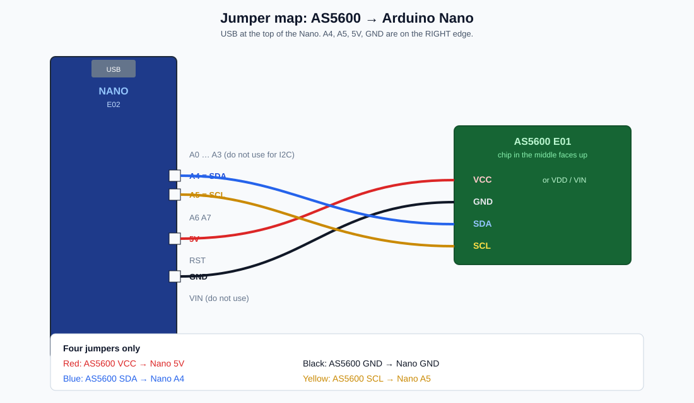
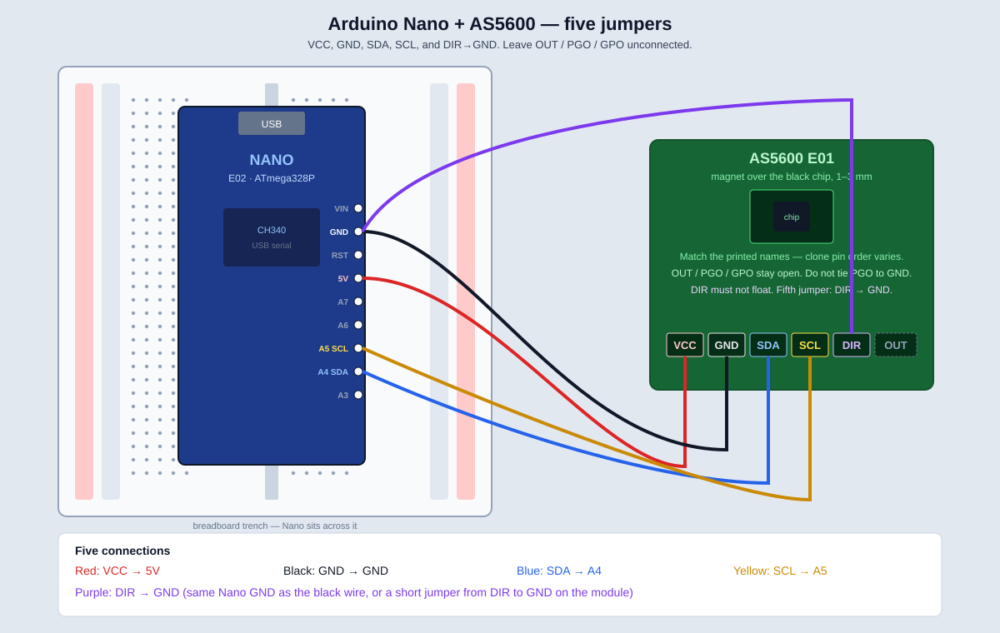
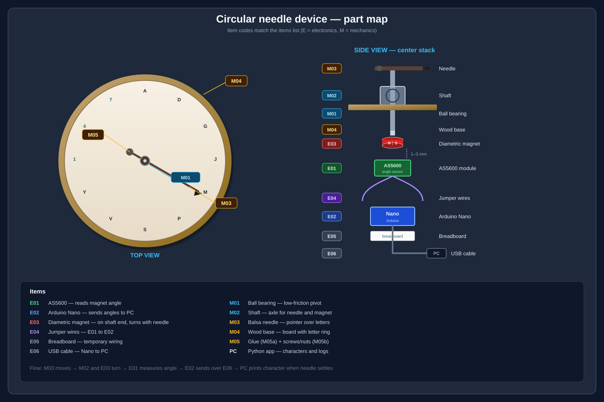

# Circular Needle Character Input Device

A free-spinning needle over a circular dial (**A–Z**, **0–9**). When the needle settles, a character is sent to the PC over USB. A Python app prints it and writes a log file.

**Do the phases in order. Phase 2 (electronics) before any glue.**

---

## Two programs (read this first)

You use **two different tools**. Mixing them up is why this feels confusing.

| # | What | Which app | File |
|---|------|-----------|------|
| 1 | Put code **on the Nano** so it reads the magnet | **Arduino IDE** (the Arduino application) | `firmware/needle_angle_stream/needle_angle_stream.ino` |
| 2 | Show those numbers **on the PC** | **Terminal** → Python | `host/capture.py` |

- The `.ino` file is **not** Python. Do **not** run it with `python`.
- Open it **only** in **Arduino IDE** → **File → Open**.
- `capture.py` does nothing useful until step 1 has uploaded successfully.
- Red / blinking LEDs on the Nano = **power** (often the factory blink sketch). That is **not** our program until you Upload.

---


## Do this now (Arch Linux) — see rotation on the PC

### If `scan: none` — run the wire check

Software cannot always name one open wire (I2C needs all four). This sketch tests the Nano pins, optional **OUT→A0**, and prints a verdict.

1. Keep VCC, GND, SDA, SCL as usual.
2. Add one extra jumper if the module has **OUT**: **AS5600 OUT → Nano A0**.
3. Arduino IDE → **File → Open** → `firmware/wire_check/wire_check.ino` → **Upload**.
4. `python host/capture.py --all` (or Serial Monitor **115200**).
5. Read the **Verdict** line.

| Verdict | Meaning |
|---------|---------|
| I2C works | Use `needle_angle_stream.ino` again |
| A4/A5 sit LOW | That jumper is shorted or in the wrong row |
| Module looks POWERED | VCC/GND OK → SDA or SCL wrong or swapped |
| A0 near 0 | No power on the module, or OUT not on A0 |

### Wiring pictures (jumpers)

Nano-specific map (this project):



Same four wires on an Arduino-compatible board (Adafruit, 5V):



- Red: **VCC → 5V**  
- Black: **GND → GND**  
- Blue: **SDA → A4** (on Nano; Adafruit Metro uses the pin labeled SDA)  
- Yellow: **SCL → A5** (on Nano; Metro uses the pin labeled SCL)

Open in a browser:

- Adafruit wiring: https://learn.adafruit.com/adafruit-as5600-magnetic-angle-sensor/arduino  
- Nano A4/A5 I2C note: https://curiousscientist.tech/blog/as5600-magnetic-position-encoder  
- Video (VCC, GND, SDA→A4, SCL→A5): https://www.youtube.com/watch?v=dsIHC96roTM  

### How the breadboard works (read this)

Do **not** use the long **+** and **−** strips unless a step says so. Those rails are **not** 5V/GND until you add extra jumpers. We are **not** using them.

The **numbered rows** in the middle are what you use. In one row, on **one** side of the center gap, the 5 holes are the same wire:

```
     +  -                     -  +     <-- ignore these rails
     +  -                     -  +

        a  b  c  d  e     f  g  h  i  j
     1  o  o  o  o  o  |  o  o  o  o  o
     2  o  o  o  o  o  |  o  o  o  o  o
     3  o  o  o  o  o  |  o  o  o  o  o   <-- row 3 left is NOT row 3 right
        ============= trench ============
```

Example: Nano **5V** pin sits in **row 20**, right side (f–j).  
Plug the AS5600 **VCC** jumper into **another hole in row 20, same side** (f–j). That *is* connecting to 5V.

```
  Wrong:  VCC jumper in a + rail hole
  Wrong:  VCC jumper in a random numbered row
  Right:  VCC jumper in the SAME numbered row as the Nano 5V pin,
          SAME side of the trench
```

Put the Nano **across the trench** (USB at one end). Left pins use columns a–e; right pins use f–j.

Find the **printed name** on the Nano (5V, GND, A0, A4, A5). Look which **number** that pin is in. Use that number.

### A. Wire the four cables (unplug USB first)

```
AS5600 (E01)          Nano (E02)
VCC  ---------------  5V     (use 3.3V only if E01 says 3.3V-only)
GND  ---------------  GND
SDA  ---------------  A4
SCL  ---------------  A5
Nano USB  ----------  PC
```

Hold the magnet (E03) 1–3 mm above the small black chip on E01. Plug USB back in.

### B. Upload firmware with Arduino IDE (required, one time)

1. Start the **Arduino IDE** application (from the app menu or `arduino` / `arduino-ide`). This is **not** a terminal Python command.
2. Menu **File → Open**.
3. In the file picker, go to this project, then click folders:

   `firmware` → `needle_angle_stream` → select **`needle_angle_stream.ino`** → **Open**

4. The editor must show C++ that starts with `#include <Wire.h>`. If you see Python, you opened the wrong file.
5. Menu **Tools → Board → Arduino AVR Boards → Arduino Nano**.
6. Menu **Tools → Processor → ATmega328P**.
7. Menu **Tools → Port** → choose `/dev/ttyUSB0` or `/dev/ttyACM0`.

   No port listed, or **Permission denied** / `cannot open port /dev/ttyUSB0`?

   The sketch compiled; Linux is blocking the port. On Arch the group is **`uucp`**:

   ```bash
   ls -l /dev/ttyUSB0
   sudo usermod -aG uucp "$USER"
   ```

   **Log out of the desktop completely and log back in** (a new terminal is not enough). Check with `groups` — you must see `uucp`. Then set **Tools → Port** again and Upload.

   Same session without logout: `newgrp uucp`, then start Arduino IDE from **that** terminal.

8. Click the **Upload** button at the top (right arrow **→**).  
   Wait until the bottom of the IDE says **Done uploading**.

9. If Upload fails: **Tools → Processor → ATmega328P (Old Bootloader)** → Upload again.  
   Close Serial Monitor if it is open (it can lock the port).

That step copies our program **into the Nano**. After that, the Nano prints `a=123.4` over USB whenever it has power.

### C. Run the capture program (terminal, after Upload succeeds)

```bash
sudo pacman -S python-pyserial    # once, if you have not already
cd ~/medium-tool                  # your clone path
python host/capture.py --all
# or:  python host/capture.py --stream --port /dev/ttyUSB0
```

Turn the magnet. The terminal should print changing lines:

```text
a=47.3    (turn magnet — this number should move)
a=90.1    (turn magnet — this number should move)
```

**Ctrl+C** stops it.

- `a=ERR` → wiring (VCC/GND/SDA/SCL).
- No port / permission → `uucp` group + re-login.
- Same number forever → magnet not diametric, or not over the chip.

---

**Hardware path:** AS5600 (**E01**) + Arduino Nano (**E02**) → USB serial → Python on the PC.

```
  TOP VIEW                         SIDE STACK (center)

      7  A  D                         M03  ========●========► needle
    4         G                            |
  1      ●------► M                   M02  |  shaft
    Y         J                            |
      V  S  P                         M01  (====)  bearing in M04 base
                                           |
                                      E03  [N|S]   magnet on shaft END
                                           |  1-3 mm air gap
                                      E01  [AS5600]
                                           |
                                      E04  wires
                                      E02  [Nano] ---- E06 USB ---- PC
```



Item codes (**E** = electronics, **M** = mechanics) match the items list.

---

## 1. What you are building

```
You move the needle (M03)
        |
        v
Shaft (M02) turns in bearing (M01)
        |
        v
Magnet (E03) on shaft end turns
        |
        v
AS5600 (E01) measures angle 0-360  (no contact)
        |
        v
Nano (E02) prints  a=123.4  over USB (E06)
        |
        v
Python on PC  -->  maps angle to letter  -->  console + log file
```

| Spins as one unit | Stays fixed |
|-------------------|-------------|
| M03 needle, M02 shaft, E03 magnet | M01 outer race, M04 base, E01, E02, E05, PC |

Firmware on the Nano is **dumb**: it only streams angles.  
Python on the PC is **smart**: 36-letter map, A/J/S/1 confirm each session, settle detection, logs.

Repo layout:

```
medium-tool/
  README.md
  docs/device-diagram.png
  firmware/needle_angle_stream/needle_angle_stream.ino
  host/          (Python capture — add after electronics work)
  logs/          (created at runtime)
```

---

## 2. Items list (Amazon)

| Code | Item | What it does | Link |
|------|------|--------------|------|
| **E01** | AS5600 module | Measures magnet angle | [HiLetgo](https://www.amazon.com/HiLetgo-Magnetic-Encoder-Measurement-Precision/dp/B09KGWC1PT) |
| **E02** | Arduino Nano (ATmega328P + CH340) | Reads E01, sends USB serial | [ELEGOO](https://www.amazon.com/ELEGOO-Arduino-ATmega328P-Without-Compatible/dp/B0713XK923) |
| **E03** | Diametric magnet disc | Turns with shaft so E01 can sense | [Eliveshown](https://www.amazon.com/Eliveshown-Diametrically-Neodymium-6-35x6-35-diametrical/dp/B0D2C9VNVR) — skip if included with E01 |
| **E04** | Dupont jumper wires | Connect E01 pins to E02 pins | [EDGELEC](https://www.amazon.com/EDGELEC-Optional-Breadboard-Assorted-Multicolored/dp/B07GCZ52WF) |
| **E05** | Half-size breadboard | Temporary wiring, no solder | [ELEGOO](https://www.amazon.com/ELEGOO-tie-points-breadboard-Arduino-Jumper/dp/B01EV640I6) |
| **E06** | USB **data** cable | Power + serial (Mini-B or USB-C) | Often in Nano pack; must support data |
| **M01** | Bearing 693ZZ 3×8×4 mm | Low-friction pivot | [Amazon](https://www.amazon.com/Bearings-Bearing-Engine-R-830ZZ-Length/dp/B0BBZYY5VF) |
| **M02** | 3 mm stainless rod | Shaft / axle | [Sutemribor](https://www.amazon.com/Sutemribor-100mm-Straight-Helicopter-Airplane/dp/B076XY82K3) |
| **M03** | Balsa sticks | Light needle | [Amazon](https://www.amazon.com/Perfect-Modeling-Hobbies-Architecture-Mockups/dp/B0BYXN3443) |
| **M04** | ~10" wood circle | Dial / board | [Woodpeckers](https://www.amazon.com/Wooden-Plaques-Package-Unfinished-Woodpeckers/dp/B07VVFPFZR) |
| **M05a** | Super glue | Bond magnet and needle to shaft | [Loctite](https://www.amazon.com/Loctite-Super-Glue-Liquid-Professional/dp/B0CLQCKVDX) |
| **M05b** | Small screws + nuts | Counterweight on short end of needle | [M3 kit](https://www.amazon.com/340pcs-Phillips-Stainless-Assortment-Thread/dp/B075RCVVYN) |

ELEGOO Nano **without cable** needs a separate **Mini-B USB data** cable. Headers on some Nanos must be **soldered** before they sit in a breadboard.

### Tools

**Required:** PC, USB data cable, scissors/cutters, ruler, pencil.

**Optional:** CH340 driver (Windows), small screwdriver, protractor or printed 10° template, drill (~8 mm for bearing), multimeter (only if wiring fails). No voltmeter needed if angles print.

---

## 3. How each item works

### Electronics

| Code | What it is | How it works | Where |
|------|------------|--------------|--------|
| **E01** | AS5600 PCB | Hall chip reads E03 field → angle 0–360° | Under center of M04, chip facing magnet |
| **E02** | Arduino Nano | I2C to E01; USB serial `a=123.4` | Breadboard (test) or under base |
| **E03** | Solid diametric disc | Field rotates with shaft | Glued on **bottom end** of M02, 1–3 mm above E01 |
| **E04** | Dupont wires | 5V, GND, SDA, SCL | E01 ↔ E02 |
| **E05** | Breadboard | Solderless contacts | Bench, Phase 2 |
| **E06** | USB cable | Power + data | E02 → PC |

E03 is a **solid disc** (usually no hole). Glue it on the shaft **tip**. The shaft goes **through the bearing (M01)** only, not through the magnet.

### Mechanics

| Code | What it is | How it works | Where |
|------|------------|--------------|--------|
| **M01** | 3 mm ID ball bearing | Outer race fixed; shaft spins inside | Center hole of M04 |
| **M02** | 3 mm rod, ~25–40 mm | Couples needle and magnet | Through M01 |
| **M03** | Balsa pointer | What you see move | Top of M02 |
| **M04** | Wood circle | Letter ring + structure | Table |
| **M05a** | CA glue | Bonds E03 and M03 to M02 | Shaft ends |
| **M05b** | Screw + nut | Balances needle | Short end of M03 |

---

## Phase 1 — PC setup

1. Install [Arduino IDE](https://www.arduino.cc/en/software) (2.x is fine).
2. Install Python 3 and **pyserial**.

   **Arch Linux** (your case): do **not** use bare `pip install` (PEP 668). The pacman package is **`python-pyserial`**, not `pyserial`.

   Option A — system package (simplest):

   ```bash
   sudo pacman -S python-pyserial
   ```

   Option B — project virtualenv (recommended if you want isolation):

   ```bash
   cd /path/to/medium-tool
   python -m venv .venv
   source .venv/bin/activate
   pip install pyserial
   ```

   Later, always activate first: `source .venv/bin/activate`.

   **Debian/Ubuntu:** `sudo apt install python3-serial`  
   **Other / Windows / macOS:** `pip install pyserial` (or use a venv the same way).

3. Plug **E02** into the PC with **E06**. A power LED on the Nano should light.
4. In Arduino IDE: **Tools → Port**. You should see a port:
   - Windows: `COMx` (e.g. `COM3`)
   - Linux: `/dev/ttyUSB0` or `/dev/ttyACM0`
   - macOS: `/dev/cu.usbserial-…`

**Windows, no COM port:** install a **CH340** USB-serial driver, unplug/replug, try another **data** cable (not charge-only).

---

## Phase 2 — Electronics

Goal: rotate the magnet by hand and see changing `a=…` lines in Serial Monitor.

Do **not** glue anything yet.

### 2.1 Headers and breadboard

The Nano must have pin headers so it can sit in E05. If the pack is “loose headers,” solder them first (or use a presoldered Nano).

```
   Breadboard E05 (top view)

   [  +  -  . . . . . . . . . .  -  +  ]   power rails
   [  +  -  . . . . . . . . . .  -  +  ]

        .  .  .  .  .  .  .  .  .  .         one row = one electrical node
        ================================     center trench
        .  .  .  .  .  .  .  .  .  .

   Place the Nano ACROSS the trench
   so left pins and right pins are on opposite halves.
```

```
              USB (E06) to PC
                    |
              +-----+-----+
              |           |
              |   NANO    |   <-- straddle the trench
              |   E02     |
              +-----------+
   left pins in left holes     right pins in right holes
```

### 2.2 Identify Nano pins you need

Look at the silkscreen on the Nano. You need these four:

```
   Typical Nano (USB at top)

        [USB]
   D13               VIN
   ...               GND     <-- use this GND
   ...               5V      <-- power to E01 (or 3.3V if module is 3.3V-only)
   ...               A7
   ...               A6
   ...               A5 SCL  <-- clock to E01
   ...               A4 SDA  <-- data to E01
   ...               A3
```

Pin names are printed on the board. **A4** and **A5** are next to each other on the analog side.

### 2.3 Identify AS5600 (E01) pins

On the module, find labels. Use only:

```
   E01 module (example)

   [  SCL ]---- to Nano A5
   [  SDA ]---- to Nano A4
   [  GND ]---- to Nano GND
   [  VCC ]---- to Nano 5V   (3.3V if the board says 3.3V only)

   Ignore for now: OUT, DIR, PGO, GPO (if present)

   The small black IC in the middle is the sensor.
   Magnet hovers over THAT chip, not the whole PCB.
```

### 2.4 Wire E01 to E02 (E04 jumpers)

Four wires only. Colors are a suggestion (use any, but keep a mental map).

| E01 pin | Wire to E02 pin | Suggested color | Role |
|---------|-----------------|-----------------|------|
| **VCC** | **5V** | Red | Power (use **3.3V** if E01 is labeled 3.3V-only) |
| **GND** | **GND** | Black | Ground (required) |
| **SDA** | **A4** | Blue / white | I2C data |
| **SCL** | **A5** | Yellow / green | I2C clock |

```
   E01 AS5600                         E02 Nano
   +-----------+                      +-----------+
   | VCC       |-------- red ---------| 5V        |
   | GND       |-------- blk ---------| GND       |
   | SDA       |-------- blu ---------| A4        |
   | SCL       |-------- yel ---------| A5        |
   |           |                      | USB  ---------- E06 ---------- PC
   +-----------+                      +-----------+
         ^
         |  chip faces UP
```

Rules:

- Each jumper end must seat in the **same breadboard row** as the pin it should connect to (or clip onto the module header).
- Do not connect 5V to 3.3V-only modules.
- GND must be shared. No GND → nothing works.

### 2.5 Place the magnet (E03)

Hold the disc **flat**, **1–3 mm** above the **center of the black chip** on E01. Parallel to the board, like a coin hovering.

```
        side view

        E03   (=======)   diametric disc, flat
                   |
                   |  ~1-3 mm air
                   v
        E01   [#### chip ####]==== PCB ====
```

You will rotate it **in place** after firmware is running. Do not press it onto the chip. Do not glue it yet.

### 2.6 Open and flash the firmware (Arduino IDE only)

This file is **Arduino firmware**, not a Python script. Open it in the **Arduino IDE** application.

Path:

```
firmware/needle_angle_stream/needle_angle_stream.ino
```

It uses only the built-in `Wire` library. Do **not** install an extra AS5600 library. Do **not** run this file with `python`.

1. Open the **Arduino IDE** application.
2. **File → Open** → `firmware` → `needle_angle_stream` → **`needle_angle_stream.ino`**.
3. Confirm the window shows `#include <Wire.h>` at the top.
4. **Tools → Board → Arduino AVR Boards → Arduino Nano**
5. **Tools → Processor → ATmega328P**
6. **Tools → Port** → `/dev/ttyUSB0` or `/dev/ttyACM0` (or `COMx` on Windows)
7. Click **Upload** (→). Wait for **Done uploading**.

If upload fails:

1. **Tools → Processor → ATmega328P (Old Bootloader)** → Upload again.
2. Confirm the correct **Port**.
3. Close Serial Monitor, then upload (the port can be busy).
4. Press the Nano **RESET** button just as upload starts.

### 2.7 Serial Monitor

1. **Tools → Serial Monitor** (or Ctrl+Shift+M).
2. Bottom right: baud **115200** (must match the sketch).
3. You should see a stream:

```
a=47.3
a=47.4
a=48.1
a=90.2
```

4. Slowly rotate **E03** over the chip. Numbers should change. A full turn should cover about 0–360 (or wrap 359 → 0).

### 2.8 What the output means

| You see | Meaning | What to do |
|---------|---------|------------|
| `a=123.4` changing as you turn | Success | Stop Phase 2; go to Phase 3 |
| `a=ERR` over and over | I2C fail: wiring or power | Recheck VCC/GND/SDA/SCL; 5V vs 3.3V |
| `a=` stuck on one number | Magnet too far, off-chip, or axial (wrong type) | Center diametric magnet 1–3 mm over the IC |
| Blank Serial Monitor | Wrong baud or port | 115200; same port as Upload |
| Upload error | Bootloader / port | Try Old Bootloader; close Monitor |

**Pass criterion:** angles change smoothly when you rotate E03.  
**Do not assemble the wood dial until this passes.**

---

## Phase 3 — Mechanics

Do this only after Phase 2 passes.

```
   M03 needle
   ======●================►
         |
   M02   |  shaft through M01
         |
   M04   =======( M01 )=======   wood base
         |
         v  shaft END
   E03   [=======]   solid magnet glued on tip
         |
         |  1-3 mm
         v
   E01   [ AS5600 ]  fixed under base
         |
   E02   [ Nano ] ---- USB ---- PC
```

1. Cut **M02** to about 25–40 mm.
2. Fit **M01** in the center of **M04**. Put **M02** through **M01** (shaft through bearing only).
3. Glue **E03** with **M05a** on the **bottom tip** of M02, centered. Gap to E01 chip: **1–3 mm**.
4. Glue **M03** on the **top** of M02. Put **M05b** (screw + nut) on the short end; add/remove nuts until the needle stays put at any angle.
5. Mark **A–Z** then **0–9** every **10°** on M04 (36 sectors). Needle must not scrape the face.
6. Reconnect USB and confirm Serial Monitor still changes when the needle turns.

---

## Phase 4 — Type letters

The Nano only sends `a=123.4`. Python turns that into A–Z and 0–9.

**Once:** save the real sensor angle of every printed letter.  
**Every day:** confirm A, J, S, 1, then type.

Printed dials (print at 100%, no fit-to-page): `docs/dial-6in.pdf`, `docs/dial-7in.pdf`, `docs/dial-8in.pdf`, `docs/dial-9in.pdf`, `docs/dial-10in.pdf`. A at north, clockwise A–Z then 0–9. Spokes from the center; letters sit **outside** the cut circle. 6" and 7" are letter size; 8", 9", and 10" are tabloid (11×17).

### First time — `--calibrate`

```bash
python host/capture.py --calibrate
```

1. Point at **A**, tap space. Then **B**, **C**, … **Z**, **0**–**9**, going **clockwise**.
2. Wait until the live number **changes** before each tap. Sit on the tick, not past it.
3. A tap that goes backward or lands on an earlier letter is rejected. If two taps are on the same angle, the previous two letters are redone once; if they are still close, that reading is saved.
4. All 36 angles are written to `host/config.json`. Nothing is typed in this mode.

Redo `--calibrate` if you remount the magnet, reprint the dial, or letters stay wrong after a normal session.

### Every session — no flags

```bash
python host/capture.py
```

Needs a finished `--calibrate` first.

1. Point at **A** (top), tap. Then **J** (right), **S** (bottom), **1** (left).
2. The live line shows `need 63°` (example) — wait until the number is near that saved mark, then tap. J and S at the same angle are refused.
3. Tap **go**, then hold the needle on a letter. After about **1 second on the same letter**, it types.

```text
 328.1° A    0.7s | HELLO
```

Angle, current letter, hold timer, text so far. After a letter prints the timer shows `ok` — move off it before the next one. A new line starts after 60 characters.

Logs: `logs/Session_YYYY_MM_DD_HH_MM.txt` (letters) and `.log` (letters + angles).

### If something looks wrong

| Symptom | Command |
|---------|---------|
| Want to see the raw angle only | `--debug` |
| Letter is consistently wrong | `--diagnostic` (then send the log) |
| Magnet / chip not seeing a full turn | `--span` |
| No `a=…` at all | `--all` |

---

## capture.py options

Firmware prints `a=…`. Python is `host/capture.py`. One mode at a time.

```bash
python host/capture.py --help
```

### Modes

| Flag | When to use | What happens |
|------|-------------|--------------|
| *(none)* | Daily typing | Loads the 36-letter map. Confirm **A, J, S, 1**. Types a character when that letter holds for `--delay` seconds. |
| `--calibrate` | First time, or after hardware change | Walk **A–Z, 0–9**. Save every raw angle in `host/config.json`. Does **not** type. |
| `--debug` | Line up the base | Live angle only. Rotate the **base** (needle on A) until A is where you want north. Ctrl+C to stop. |
| `--diagnostic` | Letters are off | Confirm A, J, S, 1. Point at a printed letter, **Enter**, type that letter, Enter. Repeat. Ctrl+C writes a summary to `logs/Diagnostic_*.log` (raw angle, saved map, predicted letter, error). |
| `--all` | Check the firmware | Print **every** raw `a=…` sample. No letters. |
| `--stream` | Same, but quieter | Print a new line only when the angle moves a lot (see `--change-pct`). |
| `--span` | Check the magnet | Record min/max while you turn a full circle. Span ≥ 300° is good. |

### Serial (any mode)

| Option | Default | What it does |
|--------|---------|--------------|
| `--port` | first `/dev/ttyUSB*`, `/dev/ttyACM*`, or macOS `cu.usbserial*` | USB port. Example: `--port /dev/ttyUSB0` |
| `--baud` | `115200` | Must match the sketch |

### Typing (default mode)

| Option | Default | What it does |
|--------|---------|--------------|
| `--delay` | `1.0` (saved as `delay_s`) | Seconds the **same letter** must stay on screen before it types. Analog jitter is fine; changing letter resets the timer. |
| `--wrap` | `60` (saved as `wrap_cols`) | New line after this many characters. |
| `--invert` | off | Force reverse direction. Normally taken from `--calibrate`. |
| `--log-dir` | `logs/` at the repo root | Where `Session_*.txt` / `Session_*.log` go. |

`--delay` and `--wrap` are stored in `host/config.json`. They do **not** overwrite the 36 letter marks.

`--still-tol` and `--move-deg` are leftover flags. Typing does not use them.

### Stream / span

| Option | Default | What it does |
|--------|---------|--------------|
| `--change-pct` | `10` (36°) | With `--stream`, new line when the angle moves this percent of a turn. Changing this from 10 also switches to stream mode. |
| `--span-seconds` | `12` | How long `--span` records. |

### What is saved (`host/config.json`)

`--calibrate` writes the 36 letters plus `invert`. A normal session only **reads** that file and measures A, J, S, 1 to line the map up with today’s base pose.

```text
--calibrate     save A=327.4, B=338.1, … 9=317.4
python capture  measure A, J, S, 1
                stretch the saved 36 marks onto those four
                letter = nearest saved mark
                type when that letter holds ~1 s
```

### Examples

```bash
python host/capture.py --help
python host/capture.py --calibrate       # once: save all 36 letters
python host/capture.py                   # daily: A J S 1, then type
python host/capture.py --debug           # raw angle; rotate the base
python host/capture.py --diagnostic      # Enter + true letter → Diagnostic_*.log
python host/capture.py --delay 1.5       # hold a bit longer before it types
python host/capture.py --wrap 40
python host/capture.py --port /dev/ttyUSB0
python host/capture.py --all             # every raw a=…
python host/capture.py --span            # full-circle min/max
```

---

## Phase 5 — End-to-end test

1. `python host/capture.py --calibrate` — all 36 ticks, clockwise.
2. `python host/capture.py` — A, J, S, 1 (wait for `need …°`), then go.
3. Hold a letter ~1 s → **one** character. Timer on the live line counts up, then `ok`.
4. Move to the next letter and hold. After 60 characters a new line starts.

---

## Done when

- [ ] Nano port appears; firmware uploads  
- [ ] Serial Monitor shows `a=…` changing when magnet/needle turns  
- [ ] Needle free and balanced  
- [ ] Letter ring on M04  
- [ ] Settle prints one character  
- [ ] Log file grows  

---

## Arduino cheat sheet (for later)

The `.ino` is opened and uploaded **only** in Arduino IDE. Python is only `host/capture.py`.

| Task | Where |
|------|--------|
| Open firmware | Arduino IDE → File → Open → `firmware/needle_angle_stream/needle_angle_stream.ino` |
| Choose board | Tools → Board → Arduino AVR Boards → Arduino Nano |
| Choose chip / bootloader | Tools → Processor → ATmega328P (or Old Bootloader) |
| Choose USB port | Tools → Port |
| Send program to Nano | Upload button (→) |
| See `a=…` in the IDE | Tools → Serial Monitor, baud **115200** |
| See `a=…` on Arch | `python host/capture.py --all` **after** Upload succeeds |

I2C address of AS5600 is `0x36`. Raw angle is 12-bit (0–4095) → degrees = `raw * 360 / 4096`.

---

## Reproduce from scratch (checklist)

1. Buy items list; solder Nano headers if needed; get a Mini-B **data** cable if the pack has none.  
2. Phase 1: IDE + Python + port.  
3. Phase 2: four wires, magnet over chip, upload sketch, Serial Monitor 115200.  
4. Phase 3: bearing, shaft, magnet on **end**, needle, letters.  
5. Phase 4–5: `python host/capture.py --calibrate` once, then `python host/capture.py` each session (A, J, S, 1, hold to type).  
